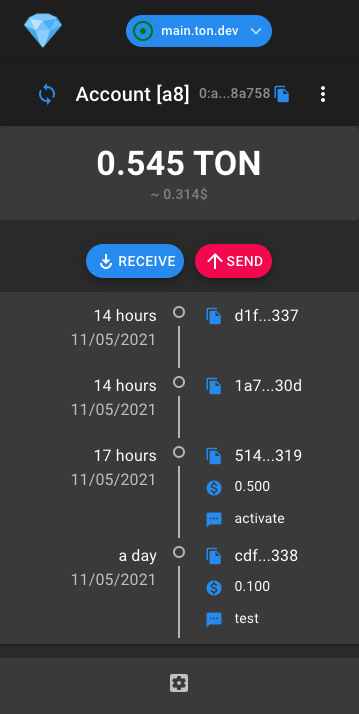
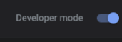

# Сrystalix wallet for TON tokens

This repository contains source code for web-extension that allow interaction with Free Ton blockchain from your browser.

# Browser supporting

* Chrome [pending publications]
* Safary [in developing]
* Firefox [in developing]

# Preview



# How build/run this extension

## Build sources

```
git clone https://github.com/extcrystalix/crystalix-extention.git
cd crystalix-extention
npm install

#npm run start #if you want to run in browser

npm run build
```

After compilation, open chrome browser, and typing ```chrome://extensions/```

Set developer mode on this page:



Press to unpacked extension:


And choose folder crystalix-extention/build